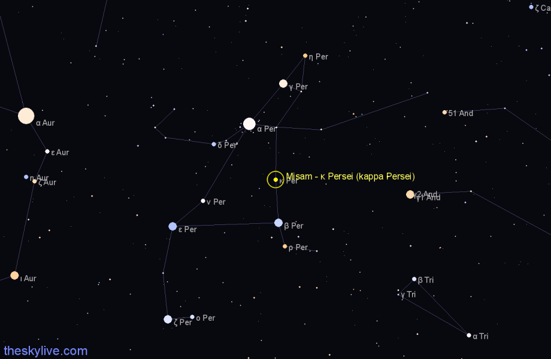

# Misam
## A backdropbuild Project

---

## Mission statement
- Create a loop machine with minimal external tools necessary to make music.
- No Latency!
- Success:
	- Waste time the project.
- Simple User interface, intuitive usage

---

## Entymology

|                  |                                                                                      |
| ---------------- | ------------------------------------------------------------------------------------ |
|  | Misam is the name of a double hypergiant star system 122.22 light years from the sun |
|                  |                                                                                      |
