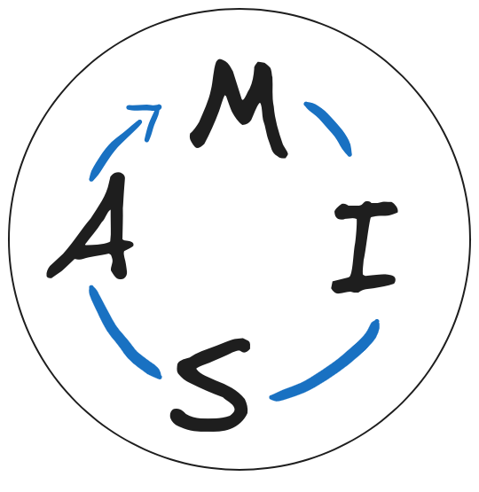

| Misam - A backdropbuild Project |  |
| ------------------------------- | --------------- |

---

## Mission statement
- Create a loop machine with minimal external tools necessary to make music.
- No Latency!
- Simple User interface, intuitive usage
---

## Tech stack
- Flutter
- C++, portaudio

---
## Demo

All audio you hear is generated through Misam
However, the recording process was heavily streamlined with prerecorded segments.
Only parts you see being played are the sounds being given to misam.